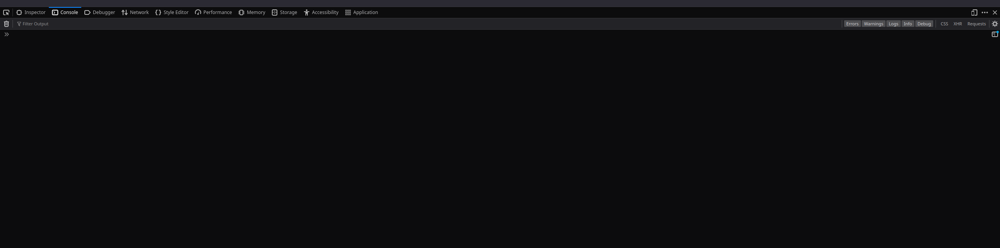
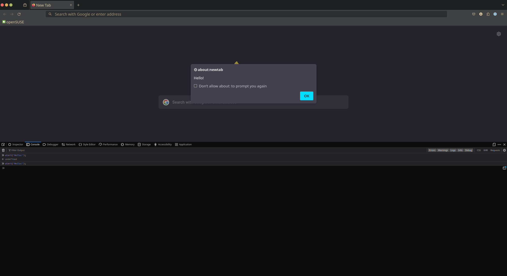

# Beginning Software Development

Getting into programming can be daunting given the vast amount of information in
the space, and knowing where to start can feel impossible especially given the
hundreds of courses promising to make you a top dev in 10 weeks. My advice would be
to use free resources for as long as possible (which could be forever), starting
by writing some small programs, then building on that knowledge with computer fundamentals, and then using _that_ knowledge to take on larger projects.

It's a rabbit hole. Be warned, once you start, there's no going back...


Here are some links that I think might be useful:

## Writing your first code

An extrememly popular programming language at the moment is [JavaScript](https://developer.mozilla.org/en-US/docs/Web/JavaScript#:~:text=JavaScript%20(JS)%20is%20a%20lightweight,Apache%20CouchDB%20and%20Adobe%20Acrobat.). 
A really easy way to get to writing some JavaScript is to open your web browser to a new tab, open developer tools (usually you can do this by pressing Ctrl+Shift+I) and clicking on the **console** tab.



Click the console and enter the text:

```JavaScript
alert('Hello, world!');
```

Press enter and you'll see an alert box appear, containing the text you entered!



You just wrote and executed a line of JavaScript which instructs the browser to display an alert box! 

JavaScript is almost the only way to significant processing in a web browser, and powers basically every website on the internet (on the _client_ side). 

To see a very basic exmaple of JavaScript on the web, open `index.html` in your browser (by right clicking it and clicking 'Open with', or pasting the full file path into your browser).

On the page, hovering over the box makes the text change! This happens because of a JavaScript function which is executed when your mouse enters and leaves the box. 

If you want to get into the syntax of JavaScript, and how web pages work here are some resources:

- [**W3Schools**](https://www.w3schools.com/) is an educational platform by the w3c (or world wide web consortium). Try building a simple website using their HTML, CSS, and JavaScript tutorials. You can do this entirely with a text editor and browser, no other tools needed to get started!

- [**Code Academy**](https://www.codecademy.com/enrolled/courses/introduction-to-javascript) is an online platform that takes you through a curriculum where you learn syntax, and programming constructs. I highly recommend this as a way to learn a language (they have courses for other languages and tools too, mostly free). it's entirely contained within the browser, and tasks are pass / fail, so you can see where you went wrong. 

- [**MDN Web Docs**](https://developer.mozilla.org/en-US/docs/Web) is an incredibly rich source of information for web standards and technologies. MDN is the Mozilla Developer Network (Mozilla are the folks that build Firefox, and contribute to web standards, so they know their stuff). 


## Things that aren't websites

Writing code that runs in the browser is a great place to start because the barrier to entry it low. You definitely have a web browser (if you're reading this on GitHub where it was published, at least), and you certainly have text editor. _But_ code runs in a vast array of environments other than web browsers, and you might be interested in playing with those environments or langauges.

[Here](https://github.com/karan/Projects) you can find a massive list of projects that might be fun or interesting to tackle. Most of them are small enough to require only a single language, and no major dependencies.

[**Battlesnake**](https://docs.battlesnake.com/) is a snake-like programming game, where you program your snake to eat as much as possible, and bite other snakes, without getting bitten itself. It's a really fun way to learn, but it might not be most beginner friendly. _Some_ knowledge of syntax of at least one language is probably a good idea (battlesnake can actually be played using any language / environment that can serve web requests). If you've picked up some JavaScript, there is a starter project [here](https://github.com/BattlesnakeOfficial/starter-snake-javascript) which might be a good start. There are some tools required for setting this up locally:

- [**chocolatey**](https://chocolatey.org/install#individual) is a package manager for windows. It helps you install lots of developer tools without going through each of their specific installation processes.

- [**Git**](https://www.git-scm.com/) is a source code management tool which allows you to version control your code. It's also the way to get the starter project from GitHub onto your local machine. Install it using Chocolatey [using these instructions](https://www.geeksforgeeks.org/how-to-install-git-on-windows-using-chocolatey/).

- [**Node.js and NPM**](https://nodejs.org/en) are a JavaScript runtime environment (something that interprets and executes JavaScript) and package manager (npm stands for Node Package Manager). You'll need npm to install the dependecies the BattleSnake starter relies on, and Node.JS to run the actual BattleSnake server locally. You can install both (as one package) via chocolatey [here](https://chocolatey.org/install#individual).

- [**P5.js**](https://p5js.org/) is a JavaScript library that provides a bunch of useful tools for drawing things on a window. You can make animations, games, generative art, and loads more stuff. It has an online editor [here](https://editor.p5js.org/) so you don't even have to set up an environment to try it out!

- [**Daniel Shiffman**](https://thecodingtrain.com/) runs a website that has loads of information about getting started programming. He has a lot of tutorials on programming algorithms using p5.js (and it's Java-based sibling, [Processing](https://processing.org/)). Search 'The Coding Train' on YouTube to find videos on creating all sorts of cool stuff. (I particularly like 'Conways Games of Life' as a starter).

## Digging Deeper

Learning to _program_ is good, but learning computer and algorithm fundamentals is great in that it gives you transferable knowledge. There are thousands of sources for information like this (some listed above, like MDN). Some sources are nonsense, and are more interested in trying to get you, as the budding developer, to try their new and shiny toy (articles with titles like 'Learn how to deploy X to Y in 10 minutes' - where the time saving thing is a tool that only costs you £50 a month and doesn't teach you anything). Here are some of the sources I like:

- [**MIT Open Courseware**](https://ocw.mit.edu/courses/6-00-introduction-to-computer-science-and-programming-fall-2008/) is MITs own programming course (from 2008). Tools come and go, but _fundamentals_ don't. So this course being from 2008 isn't that bad. It's in Python, but still very accessible even if you haven't seen the syntax before. 

- [**More MIT Open Courseware**](https://www.youtube.com/watch?v=nykOeWgQcHM&pp=ygUjbWl0IG9wZW5jb3Vyc2V3YXJlIGNvbXB1dGVyIHNjaWVuY2U%3D) - This is great lecture on the theory behind algorithms and computation. Learning theory is great, you'll be thinking about things almost all the time while programming, so might as well learn to think about thinking about things. 

- [**GitHub**](https://github.com/) is a great place to learn. More often than writing code you'll be _reading_ code. Most of that code will be written by other people, which is like being directed to make a cup of tea in a foreign kitchen, with a blindfold on. GitHub is a place for people to keep their code where other people can contribute (or so they can access it from anywhere). [Here's my account](https://github.com/dawsonalex?tab=repositories), mostly full of half finished projects, but there might be some interesting stuff to help get you along too. 

- Books! I'll add some here that I liked, when I remember the titles. 

## Other languages / tools

We've really only covered JavaScript as the language to learn here, and there are thousands out there. JavaScript is a good starter because it can be used on the frontend and backend (so you have range as a developer), but other languages excel in areas where JavaScript falls short, in terms of development practice and runtime. 

Some languages I have used and might be worth looking at:

- [Java](https://www.w3schools.com/java/java_intro.asp) - A general purpose language that I heard was initially used for Blu-Ray machines. According to the JRE installer splash screen 'Java is used in 3 Billion Devices'. That's a lot of Blu-Ray players. Java is statically typed, unlike JavaScript (no relation), so your experience programming in it will different.

- [Golang](https://go.dev/) is a personal favourite of mine at the moment. It's a strongly typed compiled language, great for command line applications and servers. It's blazing fast, and has some very nice features.

- [SQL](https://www.w3schools.com/sql/sql_intro.asp) is used for making queries to relational databases. Well worth looking into if you want persistant storage for applications. 

### Tools

- [VS Code](https://code.visualstudio.com/) is a text editor with extra bits. It's free, it's basically industry standard right now, and you can add _more_ extra bits in the form of extensions. 

- [Docker](https://www.docker.com/) is a container development tool, which is far beyond the requirements of learning to program, but might be useful at some point on Windows since it allows you to run things that otherwise won't work with Windows. 